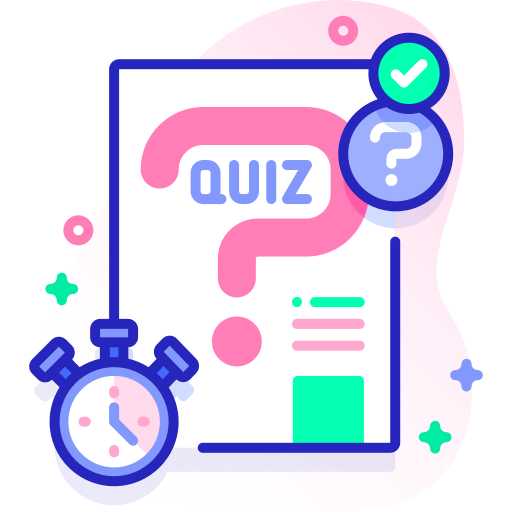
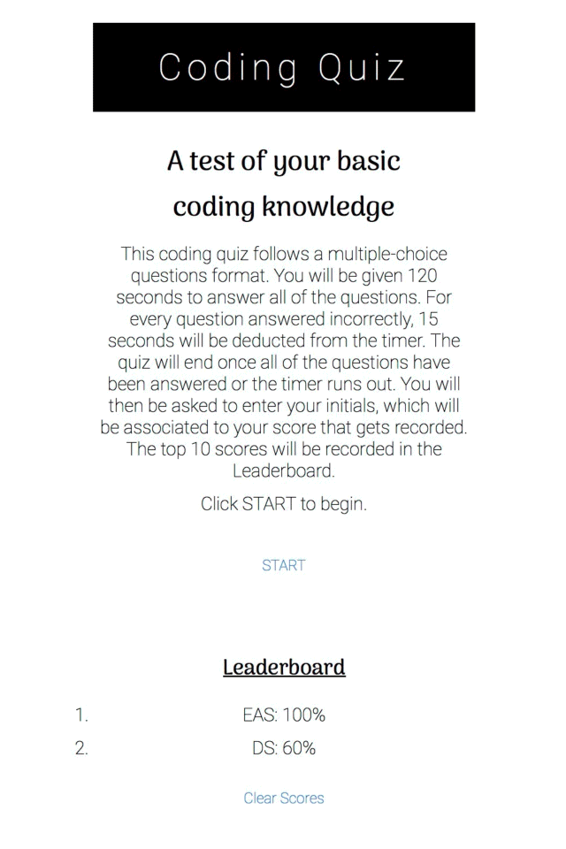

<div align="center">

<a href="https://github.com/emsim11/Code-Quiz"></a>

# Code Quiz

<h3>Test your knowledge about JavaScript with this Code Quiz application!</h3>

[](https://choosealicense.com/licenses/mit/) [](https://github.com/emsim11) [](mailto:emsimone11@gmail.com) [](https://emsim11.github.io/Code-Quiz/)

<p>
<a href="#description">Description</a> • 
<a href="#usage">Usage</a> • 
<a href="#support">Support</a> • 
<a href="#credits">Credits</a> • 
<a href="#license">License</a> </p>

</div>

<div align="center">

</a>

</div>

## Description

In this Challenge, I implement what I have learned in class about Web APIs in order to create a timed coding quiz with multiple-choice questions. Given that it is likely I will be asked in the future to complete a coding assessment - perhaps as part of an interview process - it is important to become familiar with these tests. I have utilized JavaScript and Web APIs to create the interactive features of the quiz, including the questions and answers, the timer, and the high scores. I have utilized HTML and CSS to create a clean, polished, and responsive user interface. I have based my multiple-choice questions on JavaScript information I have learned in the boot camp.

[Back to Top](#code-quiz)

### User Story

```md
AS A coding boot camp student

I WANT to take a timed quiz on JavaScript fundamentals that stores high scores

SO THAT I can gauge my progress compared to my peers
```

[Back to Top](#code-quiz)

### Acceptance Criteria

```md
GIVEN I am taking a code quiz

WHEN I click the start button

THEN a timer starts and I am presented with a question

WHEN I answer a question

THEN I am presented with another question

WHEN I answer a question incorrectly

THEN time is subtracted from the clock

WHEN all questions are answered or the timer reaches 0

THEN the game is over

WHEN the game is over

THEN I can save my initials and my score
```

[Back to Top](#code-quiz)

## Usage

Use this Coding Quiz as a way to asses your basic knowledge about JavaScript! It has a user-friendly display, and informs you whether or not you answered the question correctly by displaying either "✔️" or "𝑥" below the answer choices. To begin the game, click the "START" button. Advance through the quiz by selecting the answer choice which you believe to be the correct one. Once all ten questions have been answered, please feel free to add your score to the Leaderboard by inputting your initials and clicking the "Submit Score" button! Please **note** that the option to enter your initials to submit your score to the leaderboard will only be available **if you complete all ten questions before time runs out!**

[Back to Top](#code-quiz)

### Visuals

The gif demonstration of my Coding Quiz provides a walkthrough of the quiz's functionality and features. The first visual displays the main page that appears when the web application URL is deployed. The next visual shows how a question page appears within the quiz. The third visual displays the finished page, which allows the quiz-taker to input their initials and save their score to the Leaderboard. Please note that if you run out of time BEFORE ALL QUESTIONS ARE ANSWERED, a different page will display that says "Better luck next time!" You will NOT be able to enter your initials and submit your score to the Leaderboard if time runs out before all questions are answered.

[Back to Top](#code-quiz)

## Support

If you have any questions, or additional feedback, please feel free to contact me. I will get back to you as soon as possible.

*Contact Information:*

GitHub: [emsim11](https://github.com/emsim11)

Email: emsimone11@gmail.com

*Submit an Issue:*

If you are experiencing an issue with this application, please submit an [issue ticket](https://github.com/emsim11/Code-Quiz/issues).

[Back to Top](#code-quiz)

## Credits

Here are listed the sources that helped make this project possible.

### Authors

*The following developers helped create this project:*

- Main Developer: [Emily Simone](https://github.com/emsim11)

[Back to Top](#code-quiz)

### Acknowledgments

*The following resources were used for inspiration and guidance during the development process:*

[twqueen](https://github.com/twqueen/Module4-CodeQuiz) - CSS Styling Inspiration

## License

&copy; 2024 Emily Simone

This application is licensed under the [MIT License](./LICENSE).

[Back to Top](#code-quiz)
